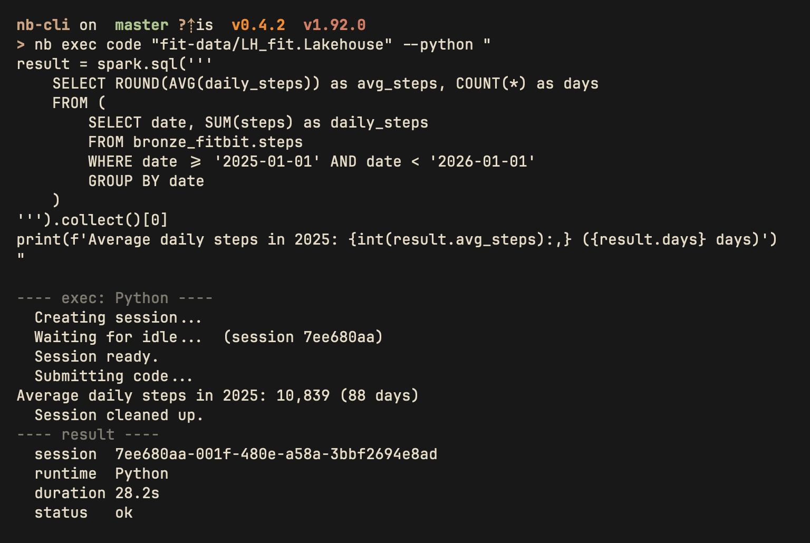

<h1 align="center">Fabric notebook CLI</h1>

<p align="center">
  A command-line interface to (try and) make it easier for agents to develop, execute, and manage notebooks in Microsoft Fabric
</p>

<p align="center">
  
  
  
</p>

> **Experimental.** Commands and flags may change between versions. Pin your version if stability matters.

## Install

```bash
cargo install nb-fabric
```

Or download a prebuilt binary from [Releases](https://github.com/data-goblin/nb-cli/releases).

## Prerequisites

- Azure CLI (`az`) installed and authenticated (`az login`)
- Access to a Microsoft Fabric workspace

## Quick Start

```bash
# Check auth
nb auth status

# List notebooks
nb list "My Workspace"

# Create a Python notebook with a lakehouse attached
nb create "My Workspace/ETL Pipeline" --kernel python --lakehouse MainLH

# Add a cell
nb cell add "My Workspace/ETL Pipeline" --code "print('hello')"

# Run code directly against a lakehouse (no notebook needed)
nb exec code "My Workspace/MainLH.Lakehouse" "print('hello')"
nb exec code "My Workspace/MainLH.Lakehouse" "spark.sql('SHOW TABLES').show()"

# Execute a notebook cell interactively
nb exec cell "My Workspace/ETL Pipeline" 0 --lakehouse MainLH

# Run as a batch job
nb job run "My Workspace/ETL Pipeline" --wait
```

## Command Reference

### Authentication

```
nb auth status                     Check Azure CLI authentication
```

### Notebook CRUD

```
nb list <workspace>                List notebooks in a workspace
nb create <ws/name>                Create a new notebook
  --kernel python|pyspark            Kernel type (default: python)
  --lakehouse <name>                 Attach a lakehouse
  --warehouse <name>                 Attach a warehouse
nb export <ws/name> -o <path>      Export notebook to local .ipynb
nb open <ws/name>                  Open notebook in browser
nb delete <ws/name> --force        Delete a notebook
```

### Cell Operations

```
nb cells <ws/name>                 List all cells (index, type, preview)
nb cell view <ws/name> <index>     View a single cell's source
nb cell add <ws/name>              Add a new cell
  --code <code>                      Cell content (required)
  --markdown                         Create markdown cell (default: code)
  --at <index>                       Insert at position (default: append)
nb cell edit <ws/name> <index>     Replace a cell's source
  --code <code>                      New content
nb cell rm <ws/name> <index>       Remove a cell
```

### Execution

```
nb exec code <ws/lakehouse> <code>   Run code directly against a lakehouse (no notebook)

nb exec cell <ws/notebook> <index>   Execute a notebook cell via its attached lakehouse
  --lakehouse <name>                   Lakehouse (auto-detected from notebook metadata)

nb job run <ws/notebook>             Run notebook as batch job
  --wait                               Wait for completion
  --timeout <secs>                     Timeout in seconds (default: 3600)
nb job list <ws/notebook>            List recent job runs
```

#### `exec code`

Run Python code against a lakehouse without creating a notebook. The `spark` (SparkSession) variable
is always available for querying lakehouse tables. Sessions are created, used, and cleaned up
automatically (including on Ctrl+C). Pass `-` as the code arg to read from stdin.

<p align="center">
  
</p>

```
$ nb exec code "My Workspace/MainLH.Lakehouse" "print(2+2)"
---- exec: Python ----
  Creating session...
  Waiting for idle...  (session a1b2c3d4)
  Session ready.
  Submitting code...
4
  Session cleaned up.
---- result ----
  session  a1b2c3d4-...
  runtime  Python
  duration 10.2s
  status   ok
```

Stdin piping for agents:

```bash
echo "spark.sql('SELECT count(*) FROM my_table').show()" | nb exec code "WS/LH.Lakehouse" -
```

#### `exec cell`

Execute a specific cell from a notebook. Auto-detects kernel type and lakehouse from notebook metadata.

```bash
nb exec cell "My Workspace/ETL Pipeline" 0
nb exec cell "My Workspace/ETL Pipeline" 3 --lakehouse MainLH
```

### Sessions

```
nb session <ws/notebook>           Show active sessions for a notebook
```

### Scheduling

```
nb schedule list <ws/notebook>     List schedules
nb schedule create <ws/notebook>   Create a schedule
  --type Cron|Daily|Weekly           Schedule type (default: Cron)
  --interval <n>                     Interval (minutes for Cron)
  --start <datetime>                 Start time (ISO 8601)
  --end <datetime>                   End time (optional)
  --timezone <tz>                    Timezone (default: UTC)
  --enable                           Enable immediately
nb schedule update <ws/notebook> <id>  Update a schedule
  --enable true|false                Enable or disable
  --interval <n>                     New interval
nb schedule delete <ws/notebook> <id>  Delete a schedule
```

## How It Works

`nb` authenticates via Azure CLI (`az account get-access-token`) using the same credentials as `fab` and `az`. It calls the [Fabric REST API](https://learn.microsoft.com/en-us/rest/api/fabric/articles/) for notebook management and interactive execution.

### Authentication

No service principal required. `nb` uses your Azure CLI session:

```bash
az login        # One-time; opens browser
nb auth status  # Verify
```

### Notebook Formats

`nb create` generates notebooks with the correct Fabric metadata for either kernel:

| Field | Python | PySpark |
|-------|--------|---------|
| `kernel_info.name` | `jupyter` | `synapse_pyspark` |
| `microsoft.language_group` | `jupyter_python` | `synapse_pyspark` |
| Runtime `kind` | `python` | `pyspark` |

## Use or Re-use

You do not have the license to copy and incorporate this into your own products, trainings, courses, or tools. If you copy this project or use an agent to rewrite it, you must include attribution and a link to the original project.

<br>

---

<p align="center">
  <em>Built with assistance from <a href="https://claude.ai/claude-code">Claude Code</a>. AI-generated code has been reviewed but may contain errors. Use at your own risk.</em>
</p>

---

<p align="center">
  <a href="https://github.com/data-goblin">Kurt Buhler</a> · <a href="https://data-goblins.com">Data Goblins</a> · part of <a href="https://tabulareditor.com">Tabular Editor</a>
</p>
